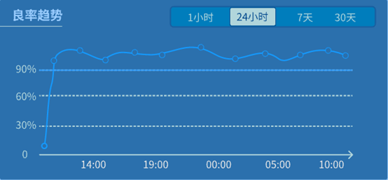
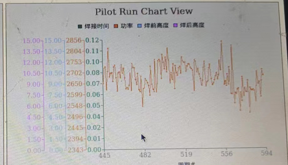
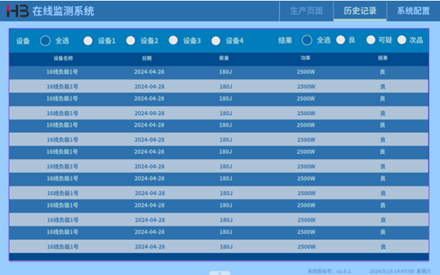
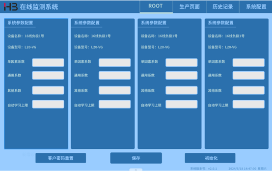

# *Online Specification Document*
### 1. Oct. 11, 2025
*There are some questions need to clarify.*
#### 1.1. 软件启动时，怎么确定连接设备个数?
根据已配置设备是否有数据输入来确定连接设备个数。
#### 1.2. 设备状态怎么确定?主要是灯的状态
当前设备状态具有三种状态分别为学习中、生产中和未连接。设备状态不存入数据库。
有数据输入时确定设备为生产状态
无数据输入时确定设备为未连接状态
创建模型时设备确定设备为学习中
There are more details explanation about these three status as following...
    1. 当设备配置完成后，且有数据输入并在新建模型界面时设备状态为“学习中”。
    2. 当设备在生产界面时，有数据输入并正常生产，则设备状态为“生产中”。
    3. 当设备已配置，但没有数据读入时，则当前设备状态为“未连接”。
#### 1.3. 软件启动后，新增连接设备怎么告知软件，还是只能由软件新增连接设备？
新增设备根据配置R232/TCP/IP等连接方式。配置成功后，能读入数据则配置成功，即新增设备成功。只能由软件本身去新增设备。  
### 2. July 9, 2024
#### 2.1. 折线图的纵轴，是固定还是根据波动自动计算最佳间隔
折现图的纵轴，是根据波动自动计算最佳上限下限。
#### 2.2. 良率趋势的时间切换
时间切换以500个点为例，横坐标展示示对应时间（1时、24时、7天、30天）等，纵坐标对应良率突出500个点 ，每次读取显示最新的（1时、24时、7天、30天）的数据来显示趋势 参考图2展现形式每个时间段的展现点数相同只是不同时间对应的不同的横坐标

    
    <b><i>图1：良品率趋势图</i></b> 

    
    <b><i>图2：老趋势图</i></b> 

#### 2.3. Production表格用于显示历史记录时，需要两个字段告知当前生产产品质量，与设备名称

    
    <b><i>图3：历史记录-待定开启</i></b> 

单一设备筛选时当设备开启待定开关状态下显示可疑按钮，未开启则不显示可疑。
当4台设备有一台设备开启可以，设备选中全部时，显示可疑按钮

#### 2.4. 语言切换功能?
语言切换: 当前只限于中英文之间切换

### 3. Database Design (June 24, 2024)
#### 3.1. Configuration Table

|字段名称|字段描述|
|-|-|
|welder_id|焊机ID|
|welder_name|焊机名称|
|welder_type|焊机型号|
|production_bacth|最大生产批量|
|model_sample|学习样本数|
|lower_limit|良率下限|
|height_option|高度模式|
|connect_type|连接方式|
|connect_id|连接方式ID|
|delete_type|逻辑删除|

*表1：Configuration Table 字段说明*

*Comments：最多四个, ID只允许1~4, 允许中间空起
新增字段 connect_type, 0_232,1_网络接口
新增字段 connect_id, 连接方式的id*

|字段名称|字段值1|字段值2|
|-|-|-|
|connect_type|0:RS232|1:network|
|delete_type|0:新增/修改|1：删除|

*表2：Configuration Table Attribute Value Description*

delete_type当该字段值为1时表示删除，删除当前配置的设备信息，当新增和修改时该字段值为0 ，查询是只查询该字段为0的数据。 
#### 3.2. Connection_Network Table
|字段名称|字段描述|
|-|-|
|id|网口号|
|type|类型|
|protocol|协议|
|local_ip|本地IP|
|local_port|本地端口|
|remote_ip|远程IP|
|server_prot|服务器端口|
|user|用户|

*表3：Connection_Network Table Description*

|字段名称|字段值1|字段值2|
|-|-|-|
|type|0:Server|1:User|
|protocol|0:TCP/IP|1:OPCUA|
|user|Branson|HB|

*表4：Connection_Network Table Attribute Value Description*

以太网接口从左至右编号为ETH0、ETH1、ETH2、ETH3、ETH4共5以太网接口，网口号对应id为1-5，id为1的网络接口用于在线监测设备数据导入导出及其他用途。设备配置的网络接口需要从id>=2配置

#### 3.3. Connection_RS232 Table
|字段名|字段描述|
|-|-|
|id|串口ID|
|port|串口号|
|baud_rate|波特率|
|data_bit|数据位|
|parity_bit|奇偶校验位|
|stop_bit|停止位|

*表5：Connection_RS232 Table Description*

#### 3.4. Io_data Table
|字段名|字段描述|
|-|-|
|id|IO_ID|
|welder_id|焊机ID|
|type|输入输出|
|pin|PIN|
|available|有效的|
|signal|信号|

*表6：Io_Data Table Description*

|字段名称|字段值1|字段值2|字段值3|
|-|-|-|-|
|type|0:input|1:output|	
|available|0:off|1:on|	
|signal|0:alarm|1:reset|2:invalid|

*表7：Io_data Table Attribute Value Description*

#### 3.5. Manual Result Table
|字段名|字段描述|
|-|-|
|id|Manual_ID|
|welder_id|焊机ID|
|create_time|创建时间|
|serial_number|序号|
|cycle_count|循环总计|
|energy|能量|
|amplitude|振幅|
|pressure|压力|
|time|焊接时间|
|power|功率|
|pre_height|焊前高度|
|post_height|焊后高度|
|actual_force|撕拉力|
|actual_residual|残留度|

*表8：Manual Result Table Description*
#### 3.6. Model Table
|字段名|字段描述|
|-|-|
|id|模型ID|
|welder_id|焊机ID|
|create_time|创建时间|
|energy|能量|
|amplitude|振幅|
|pressure|压力|
|time_alpha|焊接时间Alpha|
|time_beta|焊接时间Beta|
|power_alpha|功率Alpha|
|power_beta|功率Beta|
|pre_height_alpha|焊前高度Alpha|
|pre_height_beta|焊前高度Beta|
|post_height_alpha|焊后高度Alpha|
|post_height_beta|焊后高度Beta|
|force_alpha|撕拉力Alpha|
|force_beta|撕拉力Beta|
|residual_alpha|残留度Alpha|
|residual_beta|残留度Beta|
|current_sample_count|当前样本数|

*表9：Model Table Description*

#### 3.7. Production Table
|字段名|字段描述|
|-|-|
|id|生产ID|
|welder_id|焊机ID|
|model_id|模型ID|
|create_time|创建时间|
|serial_number|序号Barcode|
|cycle_count|循环值|
|batch_count|生产值|
|energy|能量|
|amplitude|振幅|
|pressure|压力|
|time|焊接时间|
|power|功率|
|pre_height|焊前高度|
|post_height|焊后高度|
|force|撕拉力|
|residual|残留度|
|good_rate|良率|
|good_subtotal_cycles|合格|
|suspect_subtotal_cycles|可疑|
|defective_subtotal_cycles|次品|

*表10：Production Table Description*

#### 3.8. System_configure Table
|字段名称|字段描述|
|-|-|
|id|ID|
|welder_id|焊机ID|
|single_fact_setting|单因素设置|
|general_fact_setting|通用系数设置|
|other_fact_setting|其他系数设置|
|auto_model_limit|自动学习上限|

*表11：System_Configure Table Description*

#### 3.9. User Table
|字段名|字段描述|
|-|-|
|id|用户ID|
|user_name|用户名称|
|user_password|用户密码|
|level|用户级别|

*表12：User Table Description*

|字段名称|字段值1|字段值2|
|-|-|-|
|level|1: admin用户|2: 普通用户|

*表13：User Table Attribute Value Description*

### 4. 系统界面

    
    <b><i>图4：系统配置</i></b> 

#### 4.1. 是否添加“删除设备”功能？
#### 4.2. 点击保存后不此页面隐藏，在进入页面需要输入admin密码
#### 4.3. ROOT标题放置最左段，当进入页面是显示标题，保存后隐藏

