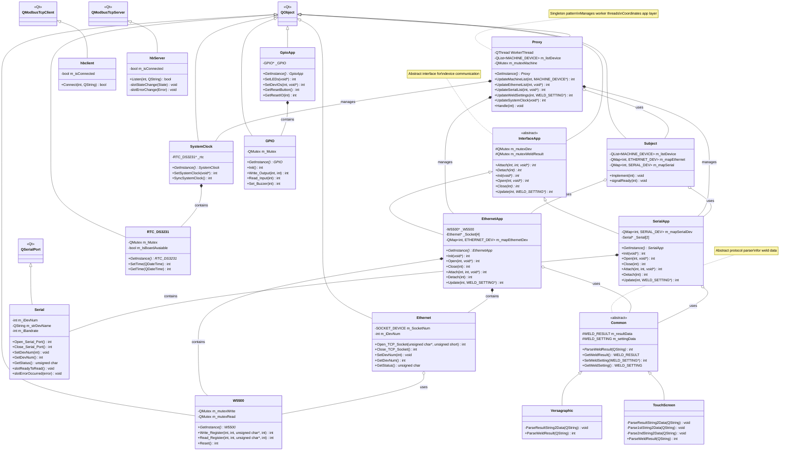

# UtilityApp Class Diagram

## Overview
This document contains the class diagram for the UtilityApp project, showing the architecture with its layers and relationships.

## Class Diagram



## Architecture Layers

### 1. **Core Pattern Layer**
- **Proxy**: Singleton managing worker threads and coordinating between GUI and business logic
- **Subject**: Observer pattern implementation for thread-safe operations

### 2. **Application Layer**
- **InterfaceApp**: Abstract base class for device interfaces
- **EthernetApp**: Manages Ethernet-based device communication
- **SerialApp**: Manages serial port communication
- **GpioApp**: Handles GPIO operations (LEDs, buttons, I/O)
- **SystemClock**: Manages system time synchronization

### 3. **Hardware Layer**
- **W5500**: Ethernet controller driver
- **Ethernet**: TCP socket management
- **Serial**: Serial port wrapper
- **GPIO**: GPIO pin control
- **RTC_DS3231**: Real-time clock interface

### 4. **Protocol Layer**
- **Common**: Abstract base for protocol parsing
- **Versagraphic**: Versagraphic protocol implementation
- **TouchScreen**: Touch screen protocol implementation

### 5. **Modbus Layer**
- **hbclient**: Modbus TCP client
- **hbServer**: Modbus TCP server

## Design Patterns Used

1. **Singleton Pattern**: Proxy, EthernetApp, SerialApp, GpioApp, SystemClock, W5500, GPIO, RTC_DS3231
2. **Observer Pattern**: Subject/Proxy with signal-slot mechanism
3. **Strategy Pattern**: Protocol classes (Common, Versagraphic, TouchScreen)
4. **Abstract Factory**: InterfaceApp hierarchy

## Key Relationships

- Proxy acts as the central coordinator
- InterfaceApp provides a unified interface for different device types
- Hardware layer is abstracted from application logic
- Protocol parsing is delegated to specialized classes
- Qt's signal-slot mechanism for inter-object communication
```
